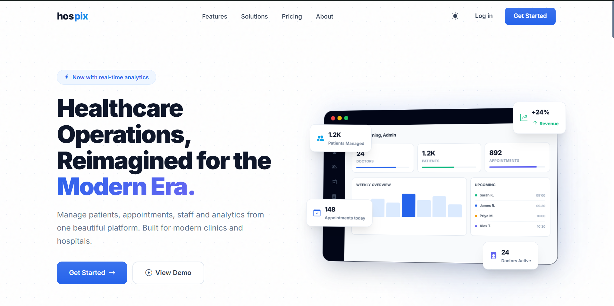
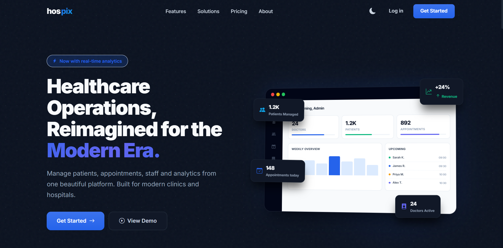
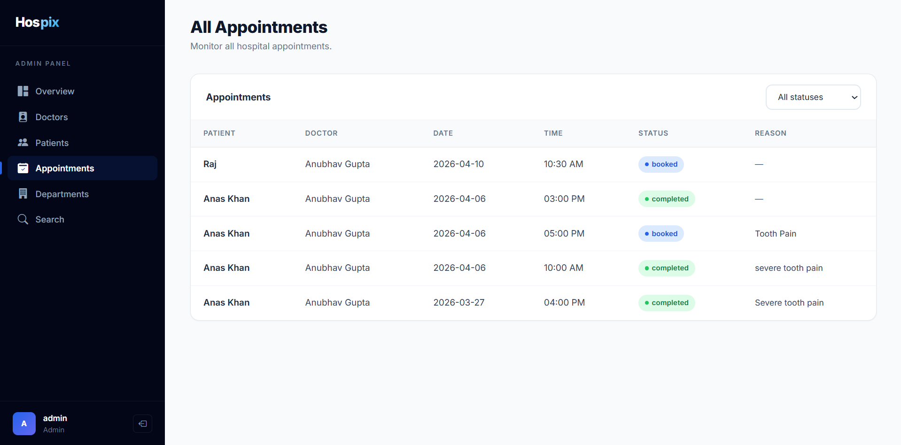

# Hospix

## Modern Healthcare Operations Platform

Hospix is a modern, SaaS-inspired Hospital Management Platform built to simplify patient management, appointment scheduling, doctor workflows, and administrative operations through a clean and responsive interface.

---


## Demo

<p align="center">
    
</p>

---

## Features

- Modern SaaS-inspired Landing Page
- Light & Dark Theme Support
- Role-Based Authentication (Admin, Doctor, Patient)
- Patient Management System
- Appointment Scheduling
- Doctor Dashboard
- Analytics Dashboard
- Responsive Design System
- Redis-Based Performance Caching
- Background Jobs using Celery
- Automated Email Reminders and Reports

---

## Screenshots

### Landing Page

<p align="center">
    
</p>

---

### Landing Dark

<p align="center">
    
</p>

---

### Appointments Portal

<p align="center">
    
</p>

---

## Tech Stack

| Component | Technology |
|------------|-----------------------------|
| Backend | Python Flask |
| Frontend | Vue.js 3 (CDN), HTML5, CSS3, JavaScript |
| Database | SQLite (SQLAlchemy ORM) |
| Caching | Redis (Flask-Caching) |
| Background Jobs | Celery + Redis |
| Email Testing | MailHog |
| Styling | Custom Design System |
| Version Control | Git & GitHub |

---

## Project Structure

```text
hospital-management-system/
│
├── backend/
│   ├── app.py
│   ├── config.py
│   ├── extensions.py
│   ├── tasks.py
│   ├── models/
│   ├── routes/
│   └── utils/
│
├── frontend/
│   ├── static/
│   │   ├── css/
│   │   └── js/
│   └── templates/
│
├── screenshots/
│   ├── 1.png
│   ├── 2.png
│   ├── 3.png
│   └── hospix-demo.gif
│
└── README.md
```

---

## Installation

### Clone the repository

```bash
git clone https://github.com/anaskhan-pd/hospix.git

cd hospix
```

### Create a virtual environment

**Windows**

```bash
python -m venv venv

venv\Scripts\activate
```

**macOS / Linux**

```bash
python3 -m venv venv

source venv/bin/activate
```

### Install dependencies

```bash
pip install -r backend/requirements.txt
```

### Start supporting services

Redis

```bash
docker run -d -p 6379:6379 --name redis-hms redis
```

MailHog

```bash
docker run -d -p 1025:1025 -p 8025:8025 --name mailhog mailhog/mailhog
```

### Start the application

Run three terminals inside the backend directory.

**Terminal 1**

```bash
python app.py
```

**Terminal 2**

```bash
python -m celery -A tasks:celery worker --loglevel=info --pool=solo
```

**Terminal 3**

```bash
python -m celery -A tasks:celery beat --loglevel=info
```

---

## Usage

Application

```
http://localhost:5000
```

MailHog

```
http://localhost:8025
```

### Default Admin Credentials

```
Email: admin@hospix.in
Password: admin@123
```

Patients can register directly from the login page.

Doctors are created through the Admin portal.

---

## Design Philosophy

Hospix was redesigned using a modern SaaS design language inspired by contemporary software platforms while maintaining healthcare usability and accessibility.

The interface focuses on:

- Consistent spacing and typography
- Responsive layouts
- Light and Dark themes
- Minimal visual hierarchy
- Smooth micro-interactions
- Clean dashboard experience

The goal is to provide a modern product experience instead of a traditional enterprise hospital interface.

---

## Roadmap

- [ ] Multi-Hospital Support
- [ ] AI Appointment Assistant
- [ ] Advanced Analytics
- [ ] Progressive Web App
- [ ] Export & Reporting Module
- [ ] Real-time Notifications

---

## Contributing

Contributions are welcome.

1. Fork the repository.
2. Create a feature branch.

```bash
git checkout -b feature/new-feature
```

3. Commit your changes.

```bash
git commit -m "Add new feature"
```

4. Push to your branch.

```bash
git push origin feature/new-feature
```

5. Open a Pull Request.

---

## License

This project is licensed under the MIT License.
